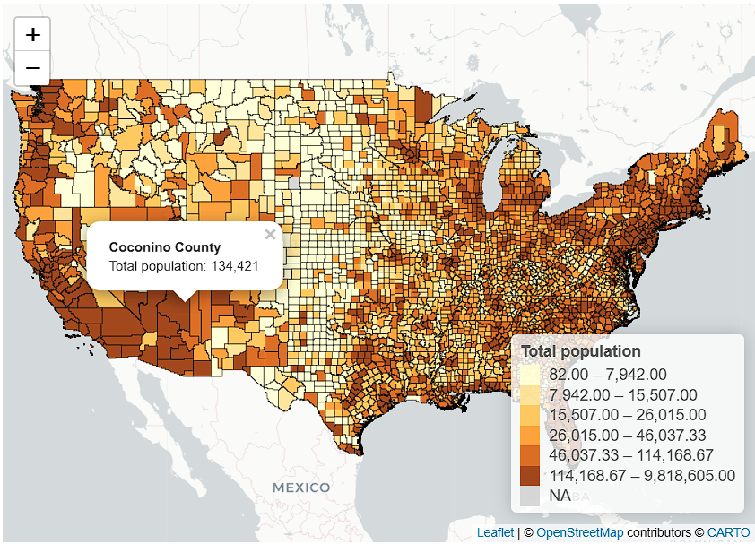
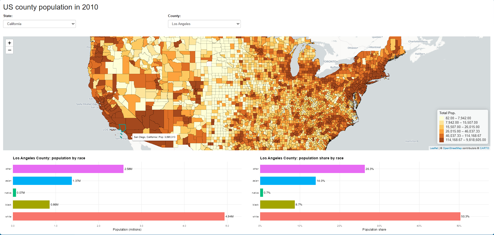

```{r setup, include=FALSE}
knitr::opts_chunk$set(
  echo = FALSE,
  message = FALSE,
  warning = FALSE,
  cache = TRUE
)
```

## **Part 1**
### **1. Preliminaries**
#### 1.1 Introduction

This project uses data from the National Historical Geographic Information System (NHGIS) to construct a spatial dataset at the county level for the United States. The objective of this preliminary phase is to combine geographic information with demographic data in order to create a dataset suitable for mapping and visualization.

Specifically, we extract county-level shapefiles and merge them with population data disaggregated by race and sex for the year 2010. This integrated dataset will later be used to explore spatial patterns across U.S. counties.

#### 1.2. Data

##### 1.2.1 Spatial Data

We begin by loading the county-level shapefile, which provides the geographic boundaries for U.S. counties. This spatial dataset will serve as the base for the analysis.

We then restrict the sample to the contiguous United States by excluding Alaska and Hawaii. This step ensures consistency in the geographic scope and improves comparability across counties.

```{r, message=FALSE, warning=FALSE}
# Load libraries
library(sf)
library(tidyverse)

# Full path to shapefile (use forward slashes)
shape_path <- "data/private/US_county_2020.shp"

# Read shapefile (this loads all US counties)
shape_us <- st_read(shape_path)

# Clean dataset
shape_us <- shape_us %>%
  mutate(STATEFP = as.integer(STATEFP)) %>%
  
  # Keep only valid US states
  filter(STATEFP < 57) %>%
  
  # Remove Alaska and Hawaii
  filter(!(STATEFP %in% c(2, 15)))

# Save cleaned version (important for future runs)
saveRDS(shape_us, "data/private/shape_us_clean.rds")

```

```{r}
dim(shape_us)
```

The dataset contains 3,108 counties, confirming that only the contiguous U.S. is included.

The data is stored as an `sf` object, meaning it contains both geographic boundaries and attributes, which makes it suitable for spatial analysis.

##### 1.2.2 Population Data (NHGIS)

We now load the NHGIS population data, which provides county-level population counts by race and sex for 2010.

These data will later be combined with the spatial dataset using a common identifier.
```{r, message=FALSE, warning=FALSE}

library(ipumsr)
library(tidyverse)

# Define the full path to the local NHGIS CSV file
pop_path <- "data/private/nhgis0005_ts_geog2010_county.csv"

# Read NHGIS time-series extract directly from the local file
# read_nhgis() keeps the NHGIS labels and structure better than a generic read_csv()
data_pop <- read_nhgis(pop_path)

```

```{r}
dim(data_pop)
```

The dataset contains 3,143 counties. Each observation includes detailed population counts disaggregated by race and sex.

The key variable for merging is `GISJOIN`, which uniquely identifies each county.

```{r, include=FALSE}
library(ipumsr)
library(tidyverse)

# Read NHGIS extract (time series / aggregate data)
data_pop <- read_nhgis(pop_path)

```

#### 1.3 Data Preparation

In this section, we prepare the NHGIS population data for analysis. Since the CW8 dataset provides population counts disaggregated by race and sex, it is necessary to carefully inspect the variable definitions before constructing aggregate population measures.

We begin by examining the metadata associated with the dataset in order to correctly interpret each variable.

```{r}
# Look for variable labels
ipums_var_info <- ipums_var_info(data_pop)
ipums_var_info
```

The metadata confirms that each CW8 variable corresponds to a specific combination of race and sex. For instance, variables such as `CW8AA2010` and `CW8AG2010` represent the male and female populations for the White racial group, respectively.

This detailed structure highlights that population counts are not directly available in aggregated form. Therefore, it is necessary to combine male and female counts within each racial category to construct total population measures by race.

This step is essential to ensure that the resulting variables are correctly defined and consistent with the underlying data structure.

##### 1.3.1 Population Variables Construction

Based on the metadata inspection, we construct aggregate population variables by summing male and female counts within each racial category.

This step transforms the dataset from a sex-disaggregated structure into a more interpretable format, where each variable represents the total population of a given racial group at the county level.

We also compute the total population as the sum of all racial categories.

```{r, include=FALSE}
library(dplyr)

# Build population variables correctly (male + female for each race)
data_pop_clean <- data_pop %>%
  mutate(
    pop_white  = CW8AA2010 + CW8AG2010,
    pop_black  = CW8AB2010 + CW8AH2010,
    pop_native = CW8AC2010 + CW8AI2010,
    pop_asian  = CW8AD2010 + CW8AJ2010,
    pop_other  = CW8AE2010 + CW8AK2010,
    pop_two    = CW8AF2010 + CW8AL2010
  ) %>%
  
  # Total population (sum of all groups)
  mutate(
    total_pop = pop_white + pop_black + pop_native +
                pop_asian + pop_other + pop_two
  ) %>%
  
  # Keep only relevant columns
  select(
    GISJOIN,
    pop_white,
    pop_black,
    pop_native,
    pop_asian,
    pop_other,
    pop_two,
    total_pop
  )
```


```{r}
head(data_pop_clean)
```

The resulting dataset contains one observation per county, identified by `GISJOIN`, along with population variables for each racial group and the total population.

The values appear consistent across counties, with `pop_white` generally representing the largest share of the population, while other groups exhibit smaller but meaningful variation. The total population variable aligns with the sum of all racial categories, confirming that the aggregation was performed correctly.

This cleaned dataset is now ready to be merged with the spatial shapefile.

##### 1.3.2 Merging Spatial and Tabular Data

We merge the spatial shapefile with the cleaned NHGIS population dataset using the `GISJOIN` identifier, which uniquely identifies each county across both sources.

The merge is performed using a left join, taking the shapefile as the reference dataset. This ensures that all counties in the spatial data are retained, while population variables are added when a match is available.

```{r, include=FALSE}
library(dplyr)

# Merge spatial data with population data using GISJOIN
shape_us <- shape_us %>%
  left_join(data_pop_clean, by = "GISJOIN")
```

```{r}
# View selected columns
shape_us %>%
  st_drop_geometry() %>%
  select(GISJOIN, NAME, pop_white, pop_black, pop_native, pop_asian, total_pop) %>%
  head()
```

The merged dataset successfully combines geographic and demographic information, resulting in a spatial dataset where each county is associated with population measures by race.

The number of observations in the final dataset is 3,108, corresponding to the counties included in the shapefile. This is slightly lower than the 3,143 observations in the NHGIS dataset, reflecting differences in geographic definitions and coverage between the two sources.

In particular, one county (Oglala Lakota, South Dakota) presents missing values after the merge. This discrepancy is likely due to a historical name change, as the county was previously known as Shannon County in 2010. Therefore, the missing observation reflects a data alignment issue rather than a coding error.

Overall, the merge appears successful, and the dataset is now ready for spatial analysis and visualization.

##### 1.4 Final Dataset Validation

Before proceeding to visualization, it is important to verify the consistency and completeness of the final dataset.

These checks ensure that the merging process was correctly performed, that the constructed variables behave as expected, and that no significant data issues remain. This step is essential to guarantee that subsequent spatial analysis is based on reliable and well-defined data.

```{r}
library(dplyr)
library(sf)

# Check object class and dimensions
class(shape_us)
dim(shape_us)

# Check missing values in main variables
shape_us %>%
  st_drop_geometry() %>%
  summarise(
    missing_white  = sum(is.na(pop_white)),
    missing_black  = sum(is.na(pop_black)),
    missing_native = sum(is.na(pop_native)),
    missing_asian  = sum(is.na(pop_asian)),
    missing_total  = sum(is.na(total_pop))
  )

# Summary statistics for population variables
shape_us %>%
  st_drop_geometry() %>%
  select(pop_white, pop_black, pop_native, pop_asian, total_pop) %>%
  summary()
```


We perform a set of validation checks to ensure the integrity of the final dataset. The object remains an `sf` data frame with 3,108 observations, confirming that the spatial structure is preserved after the merge.

Summary statistics indicate that the population variables are well-defined and exhibit plausible distributions across counties. In particular, `pop_white` represents the largest share in most counties, while other groups show smaller but meaningful variation. 

The missing value check reveals only one observation with missing population data, suggesting that the merge was largely successful.

```{r}
# Find counties with missing population data
shape_us %>%
  st_drop_geometry() %>%
  filter(is.na(total_pop)) %>%
  select(GISJOIN, GEOID, NAME, STATEFP)
```

The only county with missing population data is Oglala Lakota County (South Dakota). This discrepancy is likely due to a historical naming change, as the county was previously known as Shannon County in 2010.

Therefore, the missing value reflects a mismatch between the spatial file (2020 geography) and the NHGIS data (2010 geography), rather than an error in the data processing pipeline.

Given that this issue affects only one observation, it does not materially impact the analysis. The dataset is considered sufficiently complete for subsequent spatial visualization.

### **2 - Task 1: County population barplots**

#### 2.1 Racial Classification and Data Construction

To validate the county-level population data, we focus on Los Angeles County in 2010. According to external census-based sources, Los Angeles County had a population of approximately 9.8 million inhabitants, with a racial composition dominated by the White population, followed by sizable Asian, Black, and other racial groups.

The goal of this task is to verify that our NHGIS-based dataset produces a consistent racial breakdown for this county. To do so, we construct two barplots: one showing absolute population counts and another showing population shares. In both cases, we use direct labels to improve readability.

```{r}
library(dplyr)
library(tidyr)

# Keep Los Angeles County only
la_county <- shape_us %>%
  st_drop_geometry() %>%
  filter(GEOID == "06037")

# Build race summary table
la_race <- la_county %>%
  transmute(
    white  = pop_white,
    black  = pop_black,
    native = pop_native,
    asian  = pop_asian,
    other  = pop_other + pop_two,
    total  = total_pop
  ) %>%
  pivot_longer(
    cols = c(white, black, native, asian, other),
    names_to = "race",
    values_to = "population"
  ) %>%
  mutate(
    share = population / first(total),
    race = factor(race, levels = c("white", "black", "native", "asian", "other"))
  )
```


```{r}
la_race
```

The resulting table shows that Los Angeles County has a total population of 9,818,605 inhabitants in 2010. The White population represents the largest group, with 4,936,599 individuals (50.3%), followed by the “other” category with 2,579,345 individuals (26.3%), and the Asian population with 1,372,959 individuals (14.0%).

The Black population accounts for 856,874 individuals (8.7%), while the Native population is comparatively small, with 72,828 individuals (0.7%).

These figures are highly consistent with external census-based estimates, confirming that the NHGIS extraction and the aggregation of race categories were correctly performed. In particular, combining “Some Other Race” and “Two or More Races” into a single “other” category aligns well with standard reporting practices.

#### 2.2 Population Counts by Race

To visualize the racial composition of Los Angeles County, we first present population counts in absolute terms. Since the total population exceeds nine million inhabitants, values are expressed in millions to improve readability while preserving the relative magnitude of each group.

The barplot is ordered by population size, allowing for a clear comparison across racial categories and highlighting the dominant groups within the county.


```{r}
library(ggplot2)
library(dplyr)

la_race_plot <- la_race %>%
  arrange(population) %>%
  mutate(race = factor(race, levels = race))

p_counts <- ggplot(la_race_plot, aes(x = population / 1e6, y = race, fill = race)) +
  geom_col(width = 0.7, show.legend = FALSE) +
  
  # value labels at the end of each bar
  geom_text(
    aes(
      x = population / 1e6,
      label = paste0(round(population / 1e6, 2), "M")
    ),
    hjust = -0.15,
    size = 4.8
  ) +
  
  scale_x_continuous(
    limits = c(0, 5.4),
    breaks = seq(0, 5, by = 1),
    expand = expansion(mult = c(0, 0.02))
  ) +
  
  labs(
    title = "Los Angeles County: population by race",
    x = "Population (millions)",
    y = NULL
  ) +
  
  theme_minimal(base_size = 14) +
  theme(
    panel.grid.major.y = element_blank(),
    panel.grid.minor = element_blank(),
    axis.text.y = element_text(size = 13, color = "black"),
    plot.title = element_text(face = "bold", size = 20),
    axis.title.x = element_text(size = 14)
  )

p_counts
```

The barplot clearly shows that the White population is the largest group in Los Angeles County, with approximately 4.94 million individuals, representing about half of the total population. The “other” category follows with around 2.58 million individuals, reflecting a significant share of residents classified outside the main racial groups.

The Asian population is also substantial, exceeding 1.3 million individuals, while the Black population accounts for a smaller but still meaningful share. In contrast, the Native population is relatively small, which explains its limited visual presence in the chart.

Overall, the distribution aligns closely with external census-based figures, confirming that the NHGIS data extraction and aggregation were correctly implemented.

#### 2.3 Population Shares by Race

We now present the same distribution in relative terms by expressing each racial group as a share of the total population. This allows for a clearer comparison of the demographic structure, independent of absolute population size.

```{r}
library(ggplot2)
library(scales)

p_share <- ggplot(la_race_plot, aes(x = share, y = race, fill = race)) +
  geom_col(width = 0.7, show.legend = FALSE) +
  
  # value labels at the end of each bar
  geom_text(
    aes(
      x = share,
      label = percent(share, accuracy = 0.1)
    ),
    hjust = -0.15,
    size = 4.8
  ) +
  
  scale_x_continuous(
    labels = percent_format(accuracy = 1),
    limits = c(0, 0.55),
    expand = expansion(mult = c(0, 0.02))
  ) +
  
  labs(
    title = "Los Angeles County: population share by race",
    x = "Population share",
    y = NULL
  ) +
  
  theme_minimal(base_size = 14) +
  theme(
    panel.grid.major.y = element_blank(),
    panel.grid.minor = element_blank(),
    axis.text.y = element_text(size = 13, color = "black"),
    plot.title = element_text(face = "bold", size = 20),
    axis.title.x = element_text(size = 14)
  )

p_share
```

The share-based barplot highlights the relative composition of Los Angeles County’s population. The White population represents approximately 50.3% of the total, making it the largest group, followed by the “other” category with 26.3% and the Asian population with 14.0%.

The Black population accounts for 8.7% of residents, while the Native population represents less than 1%, making it the smallest group in proportional terms.

Compared to the absolute population counts, this representation provides a clearer view of the county’s demographic structure by emphasizing relative differences across groups. The results closely match external census-based figures, reinforcing the consistency and reliability of the constructed dataset.

### **3 - Task 2: All counties**

In this task, we extend the analysis from a single county to the full set of U.S. counties by mapping total population across space.

The objective is to visualize how population is distributed geographically and to identify major spatial patterns, such as densely populated urban areas and sparsely populated rural counties. To improve readability, the map uses a classified color scale rather than raw continuous shading.

```{r}
library(tmap)

tm_pop <- tm_shape(shape_us) +
  tm_polygons(
    col = "total_pop",
    style = "quantile",
    n = 6,
    palette = "YlOrBr",
    border.col = "gray70",
    border.alpha = 0.5,
    lwd = 0.2,
    title = "Total population",
    colorNA = "gray85",
    textNA = "Missing"
  ) +
  tm_layout(
    title = "Total Population by County",
    title.position = c("center", "top"),
    legend.outside = TRUE,
    legend.outside.position = "left",
    frame = FALSE,
    inner.margins = c(0.03, 0.03, 0.08, 0.03)
  )

tm_pop
```

The map reveals a highly uneven spatial distribution of population across U.S. counties. High-population counties are concentrated around major metropolitan areas, particularly along the West Coast (California), the Northeast corridor, and parts of Florida and Texas.

In contrast, large portions of the Great Plains, the Mountain West, and other rural regions display significantly lower population levels, as indicated by the lighter color tones. These areas are characterized by sparse settlement and lower population density.

The classification based on quantiles allows for a more balanced visual representation, ensuring that differences across counties are clearly distinguishable despite the strong skewness in population distribution. Overall, the map highlights the strong geographic concentration of population in urban and suburban regions across the United States.

### **4 - Task 3: leaflet**

```{r, echo=TRUE, message=FALSE, warning=FALSE}
library(leaflet)
library(sf)
library(scales)

# Transform geometry to WGS84 for leaflet
shape_us_leaflet <- st_transform(shape_us, 4326)

# Create quantile-based bins
bins_pop <- quantile(
  shape_us_leaflet$total_pop,
  probs = seq(0, 1, length.out = 7),
  na.rm = TRUE
)

# Create color palette
pal_pop <- colorBin(
  palette = "YlOrBr",
  domain = shape_us_leaflet$total_pop,
  bins = bins_pop,
  na.color = "lightgray",
  pretty = FALSE
)

# Build popup text
popup_text <- paste0(
  "<strong>", shape_us_leaflet$NAME, " County</strong><br>",
  "Total population: ", comma(shape_us_leaflet$total_pop)
)

# Create interactive leaflet map
leaflet(shape_us_leaflet) %>%
  addProviderTiles(providers$CartoDB.Positron) %>%
  addPolygons(
    fillColor = ~pal_pop(total_pop),
    fillOpacity = 0.9,
    color = "black",
    weight = 0.6,
    opacity = 0.7,
    smoothFactor = 0.2,
    popup = popup_text
  ) %>%
  addLegend(
    pal = pal_pop,
    values = ~total_pop,
    opacity = 0.9,
    title = "Total population",
    position = "bottomright"
  )
```

<p align="center">
  
</p>

The interactive map provides a detailed view of population distribution across U.S. counties, allowing users to explore the data dynamically. By clicking on individual counties, users can access specific information such as the county name and total population, which enhances interpretability compared to static maps.

The use of quantile-based classification improves the visual balance of the map by distributing counties more evenly across color categories. This is particularly important given the highly skewed distribution of population, where a small number of counties contain very large populations.

The map highlights clear spatial patterns, with high-population counties concentrated in major metropolitan areas such as California, Texas, Florida, and the Northeast corridor. In contrast, large rural regions, especially in the Great Plains and Mountain West, exhibit much lower population levels.

Overall, the interactive format allows for both macro-level pattern recognition and micro-level exploration, making it a powerful tool for understanding geographic population distributions.

### **5 - Task 4: Shiny**

In this task, we build an interactive dashboard using Shiny to explore county-level population data in the United States. The application allows users to select a state and a county either manually or directly from the map.

The dashboard combines an interactive map with dynamic barplots. Once a county is selected, the corresponding population distribution by race is automatically displayed, both in absolute terms and as shares.

This setup enables a more intuitive and flexible exploration of the data, linking geographic information with demographic insights in real time.

```{r, echo=TRUE, message=FALSE, warning=FALSE, eval=FALSE} 
library(sf)
library(dplyr)
library(ipumsr)

# Paths
shape_path <- "data/private/US_county_2020.shp"
pop_path   <- "data/private/nhgis0005_ts_geog2010_county.csv"

# Read shapefile
shape_us <- st_read(shape_path, quiet = TRUE) %>%
  mutate(STATEFP = as.integer(STATEFP)) %>%
  filter(STATEFP < 57, !(STATEFP %in% c(2, 15)))

# Read NHGIS population data
data_pop <- read_nhgis(pop_path)

# Build race variables
data_pop_clean <- data_pop %>%
  mutate(
    pop_white  = CW8AA2010 + CW8AG2010,
    pop_black  = CW8AB2010 + CW8AH2010,
    pop_native = CW8AC2010 + CW8AI2010,
    pop_asian  = CW8AD2010 + CW8AJ2010,
    pop_other  = CW8AE2010 + CW8AK2010,
    pop_two    = CW8AF2010 + CW8AL2010,
    total_pop  = pop_white + pop_black + pop_native + pop_asian + pop_other + pop_two
  ) %>%
  select(GISJOIN, pop_white, pop_black, pop_native, pop_asian, pop_other, pop_two, total_pop)

# Merge
shape_us <- shape_us %>%
  left_join(data_pop_clean, by = "GISJOIN")

# Save final file
saveRDS(
  shape_us,
  "data/private/shape_us_final.rds"
)

cat("File created: shape_us_final.rds\n")

#####
# APP
#####

library(shiny)
library(leaflet)
library(sf)
library(dplyr)
library(ggplot2)
library(scales)

# =========================
# 1. LOAD FINAL DATA
# =========================

shape_us <- readRDS("data/private/shape_us_final.rds")

state_lookup <- c(
  "01"="Alabama","04"="Arizona","05"="Arkansas","06"="California","08"="Colorado",
  "09"="Connecticut","10"="Delaware","11"="District of Columbia","12"="Florida",
  "13"="Georgia","16"="Idaho","17"="Illinois","18"="Indiana","19"="Iowa",
  "20"="Kansas","21"="Kentucky","22"="Louisiana","23"="Maine","24"="Maryland",
  "25"="Massachusetts","26"="Michigan","27"="Minnesota","28"="Mississippi",
  "29"="Missouri","30"="Montana","31"="Nebraska","32"="Nevada","33"="New Hampshire",
  "34"="New Jersey","35"="New Mexico","36"="New York","37"="North Carolina",
  "38"="North Dakota","39"="Ohio","40"="Oklahoma","41"="Oregon","42"="Pennsylvania",
  "44"="Rhode Island","45"="South Carolina","46"="South Dakota","47"="Tennessee",
  "48"="Texas","49"="Utah","50"="Vermont","51"="Virginia","53"="Washington",
  "54"="West Virginia","55"="Wisconsin","56"="Wyoming"
)

shape_us_leaflet <- shape_us %>%
  st_transform(4326) %>%
  st_make_valid() %>%
  mutate(
    STATEFP = as.integer(STATEFP),
    state_fips = sprintf("%02d", STATEFP),
    state_name = unname(state_lookup[state_fips]),
    pop_other_total = pop_other + pop_two
  ) %>%
  filter(!is.na(state_name), !is.na(total_pop))

counties_df <- shape_us_leaflet %>%
  st_drop_geometry() %>%
  select(
    GEOID, NAME, state_name,
    pop_white, pop_black, pop_native, pop_asian, pop_other_total, total_pop
  )

bins_pop <- unique(quantile(shape_us_leaflet$total_pop, probs = seq(0, 1, length.out = 7), na.rm = TRUE))

pal_pop <- colorBin(
  palette = "YlOrBr",
  domain = shape_us_leaflet$total_pop,
  bins = bins_pop,
  pretty = FALSE,
  na.color = "lightgray"
)

default_state <- "California"

# =========================
# 2. UI
# =========================

ui <- fluidPage(
  titlePanel("US county population in 2010"),
  
  fluidRow(
    column(
      width = 4,
      selectInput(
        "state",
        "State:",
        choices = sort(unique(counties_df$state_name)),
        selected = default_state,
        selectize = FALSE
      )
    ),
    column(
      width = 4,
      uiOutput("county_ui")
    )
  ),
  
  br(),
  
  fluidRow(
    column(
      width = 12,
      leafletOutput("map_shape", height = 470)
    )
  ),
  
  br(),
  
  fluidRow(
    column(
      width = 6,
      plotOutput("plot_counts", height = 320)
    ),
    column(
      width = 6,
      plotOutput("plot_share", height = 320)
    )
  )
)

# =========================
# 3. SERVER
# =========================

server <- function(input, output, session) {
  
  selected_from_map <- reactiveVal(NULL)
  
  counties_in_state <- reactive({
    req(input$state)
    
    counties_df %>%
      filter(state_name == input$state) %>%
      arrange(NAME)
  })
  
  output$county_ui <- renderUI({
    df <- counties_in_state()
    req(nrow(df) > 0)
    
    selected_county <- NULL
    
    if (!is.null(selected_from_map()) && selected_from_map() %in% df$GEOID) {
      selected_county <- selected_from_map()
    } else if (input$state == "California" && "Los Angeles" %in% df$NAME) {
      selected_county <- df$GEOID[df$NAME == "Los Angeles"][1]
    } else {
      selected_county <- df$GEOID[1]
    }
    
    selectInput(
      "county",
      "County:",
      choices = setNames(df$GEOID, df$NAME),
      selected = selected_county,
      selectize = FALSE
    )
  })
  
  observeEvent(input$map_shape_shape_click, {
    click <- input$map_shape_shape_click
    req(click$id)
    
    clicked_row <- counties_df %>%
      filter(GEOID == click$id)
    
    req(nrow(clicked_row) == 1)
    
    selected_from_map(click$id)
    updateSelectInput(session, "state", selected = clicked_row$state_name[1])
  })
  
  selected_county_df <- reactive({
    req(input$county)
    
    out <- counties_df %>%
      filter(GEOID == input$county)
    
    req(nrow(out) == 1)
    out
  })
  
  selected_county_sf <- reactive({
    req(input$county)
    
    out <- shape_us_leaflet %>%
      filter(GEOID == input$county)
    
    req(nrow(out) == 1)
    out
  })
  
  race_df <- reactive({
    x <- selected_county_df()
    
    data.frame(
      race = factor(
        c("white", "black", "native", "asian", "other"),
        levels = c("white", "black", "native", "asian", "other")
      ),
      population = c(
        x$pop_white,
        x$pop_black,
        x$pop_native,
        x$pop_asian,
        x$pop_other_total
      )
    ) %>%
      mutate(
        share = population / sum(population, na.rm = TRUE)
      )
  })
  
  output$map_shape <- renderLeaflet({
    leaflet(
      shape_us_leaflet,
      options = leafletOptions(preferCanvas = TRUE)
    ) %>%
      addProviderTiles(providers$CartoDB.Positron) %>%
      addPolygons(
        layerId = ~GEOID,
        fillColor = ~pal_pop(total_pop),
        fillOpacity = 0.9,
        color = "black",
        weight = 0.3,
        opacity = 0.7,
        smoothFactor = 0.2,
        label = ~paste0(NAME, ", ", state_name, " | Pop: ", comma(total_pop)),
        popup = ~paste0(
          "<strong>Total Population:</strong> ", comma(total_pop), "<br>",
          "<strong>County ID:</strong> ", GEOID, "<br>",
          "<strong>County:</strong> ", NAME, "<br>",
          "<strong>State:</strong> ", state_name
        )
      ) %>%
      addLegend(
        pal = pal_pop,
        values = ~total_pop,
        opacity = 0.9,
        title = "Total Pop.",
        position = "bottomright"
      )
  })
  
  observe({
    sf_sel <- selected_county_sf()
    
    leafletProxy("map_shape") %>%
      clearGroup("selected") %>%
      addPolygons(
        data = sf_sel,
        group = "selected",
        fill = FALSE,
        color = "#00BFC4",
        weight = 4
      )
  })
  
  output$plot_counts <- renderPlot({
    df <- race_df()
    county_name <- selected_county_df()$NAME
    
    ggplot(df, aes(x = population / 1e6, y = race, fill = race)) +
      geom_col(width = 0.7, show.legend = FALSE) +
      geom_text(
        aes(label = paste0(round(population / 1e6, 2), "M")),
        hjust = -0.12,
        size = 4.2
      ) +
      scale_x_continuous(
        labels = label_number(accuracy = 0.1),
        expand = expansion(mult = c(0, 0.08))
      ) +
      labs(
        title = paste0(county_name, " County: population by race"),
        x = "Population (millions)",
        y = NULL
      ) +
      theme_minimal(base_size = 13) +
      theme(
        plot.title = element_text(face = "bold"),
        axis.text.y = element_text(color = "black"),
        panel.grid.minor = element_blank()
      )
  })
  
  output$plot_share <- renderPlot({
    df <- race_df()
    county_name <- selected_county_df()$NAME
    
    ggplot(df, aes(x = share, y = race, fill = race)) +
      geom_col(width = 0.7, show.legend = FALSE) +
      geom_text(
        aes(label = percent(share, accuracy = 0.1)),
        hjust = -0.12,
        size = 4.2
      ) +
      scale_x_continuous(
        labels = percent_format(accuracy = 1),
        limits = c(0, max(df$share) * 1.12),
        expand = expansion(mult = c(0, 0.02))
      ) +
      labs(
        title = paste0(county_name, " County: population share by race"),
        x = "Population share",
        y = NULL
      ) +
      theme_minimal(base_size = 13) +
      theme(
        plot.title = element_text(face = "bold"),
        axis.text.y = element_text(color = "black"),
        panel.grid.minor = element_blank()
      )
  })
}

shinyApp(ui = ui, server = server)
```


<p align="center">
  
</p>

The screenshot above presents the final Shiny dashboard, which combines an interactive map with dynamic data visualization. The map displays the spatial distribution of total population across U.S. counties using a color scale based on quantiles, allowing users to easily identify areas with higher and lower population levels.

Users can interact with the dashboard in two ways: by selecting a state and county from the dropdown menus, or by directly clicking on a county on the map. This creates a smooth connection between geographic exploration and data selection.

In this example, Los Angeles County (California) is selected. Once a county is chosen, the two barplots below the map update automatically. The left plot shows population counts by race in absolute terms, while the right plot presents the same information as population shares. This dual representation allows for both magnitude comparison and proportional analysis.

The results highlight clear demographic patterns. Los Angeles County has a large and diverse population, where the White group represents the largest share, followed by the “other” category and the Asian population. The Black and Native populations are smaller but still visible in the distribution.

Overall, the dashboard provides an intuitive and interactive way to explore both spatial and demographic dimensions of the data, linking geographic context with detailed statistical insights in real time

## **Part 2**
### **1. Preliminaries**

#### Introduction 1.0

In this project, we analyze the consequences of the 2022 summer heatwave in Italy by combining temperature data from ERA5 with weekly mortality data. The objective is to explore whether unusually high temperatures are associated with increases in all-cause mortality.

We first construct a temperature dataset for Italy using reanalysis data at a daily frequency, which is then aggregated to weekly averages at the national level. This allows us to build a consistent time series of temperature from 2015 to 2022, defining a reference period (2015–2020) against which the summer of 2022 can be compared.

Next, we use the World Mortality Dataset to obtain weekly mortality data for Italy. After cleaning and aligning both datasets, we estimate a simple time-series model to capture expected mortality patterns based on historical trends and seasonality. This model is then used to compute excess mortality during the summer of 2022.

Finally, we explore the relationship between temperature and mortality using a bin-scatter approach, which provides a flexible and intuitive way to visualize how mortality changes across different temperature levels.

Overall, this analysis provides a simplified but informative framework to assess the impact of extreme heat on mortality at the national level.

#### Task 1.1

To obtain temperature data for Italy, we use the ERA5 reanalysis dataset through the ECMWF API. The data is accessed programmatically using the ecmwfr package, which allows us to submit structured requests and retrieve climate data directly from the Copernicus Climate Data Store.

Following the project guidelines, we focus on the 2-meter surface temperature variable, which is a standard measure of near-surface air temperature. The spatial extent is defined using a bounding box covering Italy.

Although the original instructions refer to hourly data, we instead request daily mean temperatures. This choice is made for two main reasons. First, daily data significantly reduces computational complexity and storage requirements, making the workflow more efficient. Second, since the analysis is ultimately conducted at the weekly level, daily averages provide sufficient temporal resolution without losing relevant information.

Separate requests are submitted for each year from 2015 to 2022. After approval by the API system, the corresponding NetCDF files are downloaded and stored locally. These files are then organized, renamed, and prepared for further processing in the subsequent steps of the analysis.

```{r, eval=params$download_climate_data}
library(keyring)
library(ecmwfr)
```
```{r, eval=params$download_climate_data}
cds_api_key <- Sys.getenv("CDS_API_KEY")
if (!nzchar(cds_api_key)) stop("Set CDS_API_KEY privately before requesting climate data.")
wf_set_key(key = cds_api_key)
```
```{r, eval=params$download_climate_data}
dir.create("data", showWarnings = FALSE)
dir.create("data/raw", recursive = TRUE, showWarnings = FALSE)
```
We submit one API request for each year between 2015 and 2022. Since the structure of the request is identical across years, only one representative example is shown in the report. The remaining requests follow the same logic and are used to build the full temperature series for the analysis period.

```{r, echo=TRUE, message=FALSE, warning=FALSE, eval=params$download_climate_data}
request_2015 <- list(
  dataset_short_name = "derived-era5-single-levels-daily-statistics",
  product_type = "reanalysis",
  variable = "2m_temperature",
  year = "2015",
  month = sprintf("%02d", 1:12),
  day = sprintf("%02d", 1:31),
  daily_statistic = "daily_mean",
  time_zone = "utc+00:00",
  frequency = "1_hourly",
  area = c(46, 5, 37, 19),
  target = "Italy_daily_2015.nc"
)

job_2015 <- wf_request(
  request = request_2015,
  transfer = FALSE,
  path = "data/raw"
)

job_2015

```
```{r, include=FALSE, eval=params$download_climate_data}
request_2016 <- list(
  dataset_short_name = "derived-era5-single-levels-daily-statistics",
  product_type = "reanalysis",
  variable = "2m_temperature",
  year = "2016",
  month = sprintf("%02d", 1:12),
  day = sprintf("%02d", 1:31),
  daily_statistic = "daily_mean",
  time_zone = "utc+00:00",
  frequency = "1_hourly",
  area = c(46, 5, 37, 19),
  target = "Italy_daily_2016.nc"
)

job_2016 <- wf_request(
  request = request_2016,
  transfer = FALSE,
  path = "data/raw"
)

job_2016
```
```{r, include=FALSE, eval=params$download_climate_data}
request_2017 <- list(
  dataset_short_name = "derived-era5-single-levels-daily-statistics",
  product_type = "reanalysis",
  variable = "2m_temperature",
  year = "2017",
  month = sprintf("%02d", 1:12),
  day = sprintf("%02d", 1:31),
  daily_statistic = "daily_mean",
  time_zone = "utc+00:00",
  frequency = "1_hourly",
  area = c(46, 5, 37, 19),
  target = "Italy_daily_2017.nc"
)

job_2017 <- wf_request(
  request = request_2017,
  transfer = FALSE,
  path = "data/raw"
)

job_2017
```
```{r, include=FALSE, eval=params$download_climate_data}
request_2018 <- list(
  dataset_short_name = "derived-era5-single-levels-daily-statistics",
  product_type = "reanalysis",
  variable = "2m_temperature",
  year = "2018",
  month = sprintf("%02d", 1:12),
  day = sprintf("%02d", 1:31),
  daily_statistic = "daily_mean",
  time_zone = "utc+00:00",
  frequency = "1_hourly",
  area = c(46, 5, 37, 19),
  target = "Italy_daily_2018.nc"
)

job_2018 <- wf_request(
  request = request_2018,
  transfer = FALSE,
  path = "data/raw"
)

job_2018
```
```{r, include=FALSE, eval=params$download_climate_data}
request_2019 <- list(
  dataset_short_name = "derived-era5-single-levels-daily-statistics",
  product_type = "reanalysis",
  variable = "2m_temperature",
  year = "2019",
  month = sprintf("%02d", 1:12),
  day = sprintf("%02d", 1:31),
  daily_statistic = "daily_mean",
  time_zone = "utc+00:00",
  frequency = "1_hourly",
  area = c(46, 5, 37, 19),
  target = "Italy_daily_2019.nc"
)

job_2019 <- wf_request(
  request = request_2019,
  transfer = FALSE,
  path = "data/raw"
)

job_2019
```
```{r, include=FALSE, eval=params$download_climate_data}
request_2020 <- list(
  dataset_short_name = "derived-era5-single-levels-daily-statistics",
  product_type = "reanalysis",
  variable = "2m_temperature",
  year = "2020",
  month = sprintf("%02d", 1:12),
  day = sprintf("%02d", 1:31),
  daily_statistic = "daily_mean",
  time_zone = "utc+00:00",
  frequency = "1_hourly",
  area = c(46, 5, 37, 19),
  target = "Italy_daily_2020.nc"
)

job_2020 <- wf_request(
  request = request_2020,
  transfer = FALSE,
  path = "data/raw"
)

job_2020
```
```{r, include=FALSE, eval=params$download_climate_data}
request_2021 <- list(
  dataset_short_name = "derived-era5-single-levels-daily-statistics",
  product_type = "reanalysis",
  variable = "2m_temperature",
  year = "2021",
  month = sprintf("%02d", 1:12),
  day = sprintf("%02d", 1:31),
  daily_statistic = "daily_mean",
  time_zone = "utc+00:00",
  frequency = "1_hourly",
  area = c(46, 5, 37, 19),
  target = "Italy_daily_2021.nc"
)

job_2021 <- wf_request(
  request = request_2021,
  transfer = FALSE,
  path = "data/raw"
)

job_2021
```
```{r, include=FALSE, eval=params$download_climate_data}
request_2022 <- list(
  dataset_short_name = "derived-era5-single-levels-daily-statistics",
  product_type = "reanalysis",
  variable = "2m_temperature",
  year = "2022",
  month = sprintf("%02d", 1:12),
  day = sprintf("%02d", 1:31),
  daily_statistic = "daily_mean",
  time_zone = "utc+00:00",
  frequency = "1_hourly",
  area = c(46, 5, 37, 19),
  target = "Italy_daily_2022.nc"
)

job_2022 <- wf_request(
  request = request_2022,
  transfer = FALSE,
  path = "data/raw"
)

job_2022
```
```{r}
library(ncdf4)

files <- list.files("data/raw", full.names = TRUE)

file_info <- data.frame(
  file = character(),
  year = integer(),
  stringsAsFactors = FALSE
)

for (f in files) {
  nc <- nc_open(f)
  
  time_vals <- nc$dim$valid_time$vals
  time_units <- nc$dim$valid_time$units
  
  origin_date <- sub("days since ", "", time_units)
  origin_date <- as.Date(substr(origin_date, 1, 10))
  
  dates <- origin_date + time_vals
  yr <- as.integer(format(min(dates), "%Y"))
  
  file_info <- rbind(
    file_info,
    data.frame(file = f, year = yr, stringsAsFactors = FALSE)
  )
  
  nc_close(nc)
}

file_info[order(file_info$year), ]
```

```{r}
for (i in 1:nrow(file_info)) {
  old_name <- file_info$file[i]
  new_name <- file.path("data/raw", paste0("Italy_daily_", file_info$year[i], ".nc"))
  
  file.rename(old_name, new_name)
}
```

We then inspect one representative NetCDF file to verify its internal structure, confirm the presence of the temperature variable (t2m), and identify the spatial and temporal dimensions used in later steps.

```{r}
library(ncdf4)

file_2015 <- "data/raw/Italy_daily_2015.nc"
nc_2015 <- nc_open(file_2015)

names(nc_2015$var)
names(nc_2015$dim)
```

```{r}
t2m_2015 <- ncvar_get(nc_2015, "t2m")
t2m_2015_C <- t2m_2015 - 273.15
```

```{r}
nc_close(nc_2015)
```

```{r}
# Loop to process all years (not shown in detail)
files <- list.files("data/raw", full.names = TRUE)

temp_list <- list()

for (f in files) {
  nc <- nc_open(f)
  temp <- ncvar_get(nc, "t2m") - 273.15
  temp_list[[f]] <- temp
  nc_close(nc)
}
```

#### Task 1.2

```{r}
library(ncdf4)
library(dplyr)
library(tidyr)
library(ggplot2)
library(readr)
library(sf)
library(rnaturalearth)
library(rnaturalearthdata)
```

We first load the 2022 temperature file and extract its spatial coordinates, time dimension, and the 2-meter temperature variable. The temperature values are converted from Kelvin to degrees Celsius to ensure consistency in the analysis

```{r}
# Load the 2022 NetCDF file
file_2022 <- "data/raw/Italy_daily_2022.nc"
nc_2022 <- nc_open(file_2022)

# Extract coordinates and time
lon <- nc_2022$dim$longitude$vals
lat <- nc_2022$dim$latitude$vals
time_vals <- nc_2022$dim$valid_time$vals
time_units <- nc_2022$dim$valid_time$units

# Extract temperature and convert from Kelvin to Celsius
t2m_2022 <- ncvar_get(nc_2022, "t2m")
t2m_2022_C <- t2m_2022 - 273.15

# Close the NetCDF file
nc_close(nc_2022)
```

We then convert the NetCDF time index into calendar dates and verify the time coverage of the file.

```{r}
# Convert NetCDF time values into calendar dates
origin_date <- sub("days since ", "", time_units)
origin_date <- as.Date(substr(origin_date, 1, 10))
dates_2022 <- origin_date + time_vals

# Check the available period
range(dates_2022)
```

To match the period highlighted in the exercise, we select the week from 1 August to 7 August 2022, which contains 03.08.2022.

```{r}
# Select the week containing 03.08.2022
week_start <- as.Date("2022-08-01")
week_end   <- as.Date("2022-08-07")

week_idx <- which(dates_2022 >= week_start & dates_2022 <= week_end)

dates_2022[week_idx]
```

The selected dates confirm that the weekly aggregation is based on the first full week of August 2022.

```{r}
# Average daily temperatures over the selected week for each grid cell
t2m_week <- apply(
  t2m_2022_C[, , week_idx, drop = FALSE],
  c(1, 2),
  mean,
  na.rm = TRUE
)
```

The weekly temperature matrix is then reshaped into a tidy data frame, where each observation corresponds to one grid cell defined by longitude and latitude.

```{r}
# Convert the matrix into a tidy data frame
temp_week_df <- expand.grid(
  longitude = lon,
  latitude = lat
) %>%
  mutate(temperature = as.vector(t2m_week)) %>%
  filter(!is.na(temperature))

head(temp_week_df)
```

This structure is convenient for plotting spatial temperature patterns using ggplot2.

```{r}
# Load Italy borders as an sf object
italy_map <- ne_countries(scale = "medium", returnclass = "sf") %>%
  filter(name == "Italy")
```

This Figure shows the spatial distribution of mean temperatures in Italy during the week from 1 to 7 August 2022. Temperatures are averaged at the grid-cell level and represented using a heatmap, with warmer tones indicating higher temperatures and cooler tones indicating lower temperatures.

```{r}
# Plot weekly mean temperatures over Italy with a cleaner map style
ggplot() +
  geom_tile(
    data = temp_week_df,
    aes(x = longitude, y = latitude, fill = temperature)
  ) +
  geom_sf(
    data = italy_map,
    fill = NA,
    color = "black",
    linewidth = 0.6
  ) +
  coord_sf(
    xlim = c(min(lon), max(lon)),
    ylim = c(min(lat), max(lat)),
    expand = FALSE
  ) +
  scale_fill_gradientn(
    colours = c("#2166ac", "#67a9cf", "#f7f7f7", "#f4a582", "#ca0020"),
    limits = range(temp_week_df$temperature, na.rm = TRUE),
    name = "temperature"
  ) +
  labs(
    title = "Mean temperatures, 01.08.2022 - 07.08.2022",
    x = NULL,
    y = NULL
  ) +
  theme_minimal(base_size = 12) +
  theme(
    panel.grid.major = element_line(
      color = "grey65",
      linetype = "dashed",
      linewidth = 0.3
    ),
    panel.grid.minor = element_blank(),
    panel.border = element_rect(
      color = "black",
      fill = NA,
      linewidth = 0.8
    ),
    axis.text = element_text(color = "black"),
    axis.title = element_blank(),
    plot.title = element_text(hjust = 0.5, face = "plain"),
    legend.title = element_text(size = 11),
    legend.text = element_text(size = 10)
  )
```

The map shows substantial spatial variation in weekly mean temperatures across Italy. Warmer conditions are concentrated in the southern part of the country and in the islands, while relatively cooler areas appear in the north and in some higher-altitude regions. This pattern is consistent with the strong summer heat conditions observed during early August 2022.

After constructing the weekly map for August 2022, we aggregate the local grid-cell temperatures to the national level. For each day, we compute the average temperature across all grid cells in Italy, and then aggregate these daily values into ISO weeks.

```{r}
library(ncdf4)
library(dplyr)
library(readr)
library(lubridate)

# List all NetCDF files
files <- list.files(
  "data/raw",
  pattern = "\\.nc$",
  full.names = TRUE
)

# Empty list to store daily national temperature series from each file
daily_list <- list()

for (f in files) {
  
  # Open NetCDF file
  nc <- nc_open(f)
  
  # Extract time variable
  time_vals <- nc$dim$valid_time$vals
  time_units <- nc$dim$valid_time$units
  
  # Convert time to Date
  origin_date <- sub("days since ", "", time_units)
  origin_date <- as.Date(substr(origin_date, 1, 10))
  dates <- origin_date + time_vals
  
  # Extract temperature and convert from Kelvin to Celsius
  t2m <- ncvar_get(nc, "t2m") - 273.15
  
  # Close file
  nc_close(nc)
  
  # Compute national daily mean temperature
  daily_mean <- sapply(seq_along(dates), function(i) {
    mean(t2m[, , i], na.rm = TRUE)
  })
  
  # Store result for this file
  daily_list[[f]] <- data.frame(
    date = dates,
    t2m = daily_mean
  )
}

# Combine all years into one daily dataset
temp_daily <- bind_rows(daily_list) %>%
  arrange(date)

# Create year and ISO week
temp_weekly <- temp_daily %>%
  mutate(
    year = isoyear(date),
    week = isoweek(date)
  ) %>%
  group_by(year, week) %>%
  summarise(
    t2m = mean(t2m, na.rm = TRUE),
    .groups = "drop"
  ) %>%
  arrange(year, week)

# Inspect result
print(temp_weekly, n = 15)

# Save weekly data to CSV
write_csv(temp_weekly, "data/italy_temperature_weekly.csv")
```

The resulting dataset provides one weekly average temperature value for Italy for each year-week combination between 2015 and 2022. This file is saved to disk and used in the following task to visualize the temperature series over time.

#### Task 1.3

We now load the weekly temperature dataset created in the previous task. This file contains one observation per year-week combination and will be used to visualize the evolution of temperature over time.

```{r}
  library(readr)
library(dplyr)
library(ggplot2)

# Load the weekly temperature data
temp_weekly <- read_csv("data/italy_temperature_weekly.csv")

# Inspect the dataset
print(temp_weekly, n = 15)
```

The dataset is structured at the weekly level and already contains the average temperature for Italy in each ISO week between 2015 and 2022.

```{r, include=FALSE}
# Create an approximate date for each ISO week
temp_weekly <- temp_weekly %>%
  mutate(
    week_date = as.Date(paste(year, week, 1, sep = "-"), format = "%Y-%U-%u")
  )

# Check the result
head(temp_weekly)
```

```{r}
# Define the summer 2022 period to highlight in the graph
summer_start <- as.Date("2022-06-01")
summer_end   <- as.Date("2022-08-31")
```

We load the weekly temperature series created in Task 1.2 and prepare it for time-series visualization. Since the data is stored by ISO year and week, we convert each year-week pair into a calendar date corresponding to the start of the week.
The graphic displays the weekly average temperature in Italy from 2015 to 2022. The shaded area highlights the summer of 2022, from June to the end of August, which is the main period of interest in this analysis.

```{r}
library(readr)
library(dplyr)
library(ggplot2)
library(lubridate)

# Load the weekly temperature data
temp_weekly <- read_csv("data/italy_temperature_weekly.csv")

# Inspect the dataset
print(temp_weekly, n = 15)

# Create a weekly date from ISO year and ISO week
temp_weekly <- temp_weekly %>%
  mutate(
    week_date = ISOweek::ISOweek2date(paste0(year, "-W", sprintf("%02d", week), "-1"))
  )

# Define the summer 2022 period
summer_start <- as.Date("2022-06-01")
summer_end   <- as.Date("2022-08-31")

# Plot the series
ggplot(temp_weekly, aes(x = week_date, y = t2m)) +
  annotate(
    "rect",
    xmin = summer_start,
    xmax = summer_end,
    ymin = -Inf,
    ymax = Inf,
    fill = "grey70",
    alpha = 0.5
  ) +
  geom_line(color = "black", linewidth = 0.5) +
  labs(
    x = NULL,
    y = "t2m"
  ) +
  theme_minimal(base_size = 12) +
  theme(
    panel.grid.minor = element_blank(),
    axis.text = element_text(color = "black"),
    axis.title = element_text(color = "black")
  )
```

The series shows a strong seasonal pattern, with temperatures rising systematically during the summer months and falling during winter. The highlighted period for summer 2022 corresponds to one of the warmest parts of the full series, which is consistent with the heatwave conditions studied in this project.

### **2. The mortality data**

#### Task 2.1

```{r}
library(readr)
library(dplyr)
library(ggplot2)
library(ISOweek)
```

```{r, include=FALSE}
# Load the World Mortality Dataset
mortality_raw <- read_csv(
  "data/world_mortality.csv"
)

# Inspect column names
names(mortality_raw)
```

We use the World Mortality Dataset to obtain weekly all-cause mortality data for Italy. The dataset is filtered to retain only observations corresponding to Italy (iso3c = "ITA") and weekly frequency.

```{r}
# Filter weekly all-cause mortality data for Italy
mortality_italy <- mortality_raw %>%
  filter(iso3c == "ITA", time_unit == "weekly") %>%
  select(country_name, iso3c, year, week = time, deaths) %>%
  arrange(year, week)

# Inspect the filtered data
print(mortality_italy, n = 15)
```

The resulting dataset contains the number of weekly deaths in Italy and is consistent with the temporal aggregation used for the temperature data.

Before proceeding, we check whether the mortality series contains missing values.

```{r}
# Check missing values in deaths
sum(is.na(mortality_italy$deaths))
```

No missing values are found in the mortality variable, indicating that the dataset is complete and does not require further cleaning.

To ensure consistency with the temperature data, we convert the ISO year-week format into a calendar date corresponding to the first day of each week.

```{r}
# Create a weekly date from ISO year and ISO week
mortality_italy <- mortality_italy %>%
  mutate(
    week = as.integer(week),
    week_date = ISOweek2date(
      paste0(year, "-W", sprintf("%02d", week), "-1")
    )
  )

# Preview the result
head(mortality_italy)
```

This transformation provides a proper time index, which allows us to align mortality and temperature data in subsequent analysis.

```{r}
# Save the cleaned Italy mortality series
write_csv(
  mortality_italy,
  "data/italy_mortality_weekly.csv"
)
```

Figure X presents the weekly all-cause mortality in Italy over time. The shaded area highlights the summer of 2022, which is the period of interest for the heatwave analysis.

```{r}
# Define the summer 2022 period
summer_start <- as.Date("2022-06-01")
summer_end   <- as.Date("2022-08-31")

# Plot weekly mortality in Italy
ggplot(mortality_italy, aes(x = week_date, y = deaths)) +
  annotate(
    "rect",
    xmin = summer_start,
    xmax = summer_end,
    ymin = -Inf,
    ymax = Inf,
    fill = "grey70",
    alpha = 0.5
  ) +
  geom_line(
    color = "black",
    linewidth = 0.5
  ) +
  labs(
    x = NULL,
    y = "deaths"
  ) +
  theme_minimal(base_size = 12) +
  theme(
    panel.grid.minor = element_blank(),
    axis.text = element_text(color = "black"),
    axis.title = element_text(color = "black")
  )
```

The mortality series exhibits clear temporal variation, with noticeable peaks that reflect periods of increased mortality. A particularly large spike is observed around 2020, likely associated with the COVID-19 pandemic.

The highlighted period for summer 2022 allows for a visual comparison of mortality levels during the heatwave relative to historical patterns.

### **3. A simple time-series model of excess mortality**

#### Task 3

We begin by loading the cleaned weekly mortality dataset constructed in Task 2. This dataset contains the number of deaths in Italy at a weekly frequency and serves as the basis for the excess mortality analysis.

```{r}
library(dplyr)
library(ggplot2)
library(ISOweek)
library(readr)

# Load cleaned mortality data
mortality <- read_csv("data/italy_mortality_weekly.csv")

# Inspect
head(mortality)
```

The dataset includes a consistent weekly time index and is ready to be used for model estimation.

To capture seasonal patterns in mortality, we construct a set of week fixed effects. In addition, a linear time trend is included through the year variable. 

```{r}
mortality <- mortality %>%
  mutate(
    week = as.integer(week),
    year = as.integer(year),
    week_factor = factor(week)   # fixed effects
  )
```

```{r}
train_data <- mortality %>%
  filter(week_date < as.Date("2020-03-01"))
```

We estimate a simple time-series model of mortality that includes a linear time trend and week fixed effects. This specification captures both long-term trends and seasonal variation in mortality. The model is estimated using data prior to March 2020, in order to avoid distortions caused by the COVID-19 pandemic.

```{r, echo=TRUE, results='hide'}
model <- lm(deaths ~ year + week_factor, data = train_data)
model
```

The inclusion of week fixed effects allows the model to capture strong seasonal patterns in mortality, which are clearly reflected in the estimated coefficients. Most week effects are negative relative to the reference week, indicating that mortality tends to be systematically lower outside peak periods of the year.

This highlights the presence of pronounced seasonality in mortality, with certain weeks consistently exhibiting higher death counts, likely associated with winter conditions.

In addition, the linear time trend (year) captures gradual changes in mortality over time, although its estimated effect is relatively small compared to the magnitude of seasonal variation.

Overall, the results confirm that seasonal patterns play a dominant role in explaining mortality fluctuations, justifying the use of week fixed effects in the model.


```{r}
mortality <- mortality %>%
  mutate(
    predicted = predict(model, newdata = mortality)
  )
```

```{r}
mortality <- mortality %>%
  mutate(
    excess = deaths - predicted
  )
```

```{r}
summer_2022 <- mortality %>%
  filter(
    week_date >= as.Date("2022-06-01"),
    week_date <= as.Date("2022-08-31")
  )
```

We estimate a simple time-series model of weekly mortality that includes a linear time trend and week fixed effects, using only data prior to March 2020 to avoid distortions caused by the COVID-19 pandemic.

The estimated coefficients reveal strong seasonal patterns in mortality, with most week effects being negative relative to the reference category, indicating that mortality is systematically higher during specific periods of the year. This confirms the importance of accounting for seasonality when modeling mortality dynamics.

The model is then used to construct a counterfactual prediction of expected mortality for the full sample, which allows us to compute excess mortality during the summer of 2022 as the difference between observed and predicted deaths.

```{r}
ggplot(summer_2022, aes(x = week_date, y = excess)) +
  geom_line(color = "red", linewidth = 1) +
  labs(
    title = "Italy: Excess deaths",
    x = "date",
    y = "death count"
  ) +
  theme_minimal(base_size = 12)
```

The figure shows a clear and substantial increase in excess mortality during the summer of 2022, particularly from mid-July to early August. During this period, excess deaths rise sharply, reaching a peak of more than 4,000 deaths per week, indicating that observed mortality was significantly higher than predicted by the model.

This pattern suggests that the model, which captures normal seasonal variation and long-term trends, is unable to explain the magnitude of mortality observed during these weeks. As a result, the large positive deviations can be interpreted as the impact of an abnormal event.

The timing of this spike coincides closely with the peak of the summer heatwave, providing strong evidence of a relationship between extreme temperatures and increased mortality.

After early August, excess mortality declines but remains positive, indicating that mortality levels continued to exceed expected values, although to a lesser extent.

We compute the total excess mortality during the summer of 2022.

```{r}
total_excess <- sum(summer_2022$excess, na.rm = TRUE)

cat("Total number of excess deaths in Italy in summer of 2022:", total_excess)
```

The total number of excess deaths during the summer of 2022 is approximately 26,783. This represents a substantial increase in mortality relative to what would be expected based on historical trends and seasonal patterns captured by the model.

Importantly, this figure reflects the cumulative impact of several consecutive weeks with elevated mortality, rather than a single isolated spike. The persistence of positive excess mortality throughout the summer suggests that the effects of the heatwave were both intense and sustained over time.

In this context, the magnitude of excess deaths provides strong evidence that the 2022 heatwave had a significant impact on population health in Italy.

### **4. The mortality and temperature relationship**

#### Task 4

To examine the relationship between temperature and mortality, we combine the weekly temperature and mortality datasets constructed in the previous tasks. Both datasets are merged at the year–week level to ensure a consistent temporal alignment between temperature and death counts.

We then explore this relationship using a bin-scatter approach. Specifically, the data are sorted by temperature and divided into a fixed number of bins (deciles). Within each bin, we compute the average temperature and the corresponding average mortality, which allows us to summarize the overall relationship while reducing noise from week-to-week fluctuations.

In addition, local linear regressions are estimated within each bin to capture the slope of the relationship between temperature and mortality in different parts of the temperature distribution. These local segments provide a more flexible representation of how mortality responds to temperature changes, without imposing a single global functional form.

This approach allows us to visualize potential non-linearities in the temperature–mortality relationship and to identify whether extreme temperatures are associated with higher mortality levels.

```{r}
library(readr)
library(dplyr)
library(ggplot2)

# ===============================
# 1. Load and merge weekly data
# ===============================
temp_weekly <- read_csv("data/italy_temperature_weekly.csv") %>%
  select(year, week, t2m)

mortality_weekly <- read_csv("data/italy_mortality_weekly.csv") %>%
  select(year, week, deaths)

temp_mortality <- temp_weekly %>%
  inner_join(mortality_weekly, by = c("year", "week")) %>%
  filter(!is.na(t2m), !is.na(deaths))

# ===============================
# 2. Create temperature bins
# ===============================
n_bins <- 10

temp_mortality <- temp_mortality %>%
  arrange(t2m) %>%
  mutate(temp_bin = ntile(t2m, n_bins))

# ===============================
# 3. Compute bin means for points
# ===============================
bin_means <- temp_mortality %>%
  group_by(temp_bin) %>%
  summarise(
    t2m = mean(t2m, na.rm = TRUE),
    mortality = mean(deaths, na.rm = TRUE),
    .groups = "drop"
  ) %>%
  arrange(t2m)

# ===============================
# 4. Compute local fitted segments
# ===============================
segments_df <- temp_mortality %>%
  group_by(temp_bin) %>%
  filter(n() >= 4) %>%
  group_modify(~{
    df <- .x
    fit <- lm(deaths ~ t2m, data = df)

    x_left  <- unname(quantile(df$t2m, 0.15, na.rm = TRUE))
    x_right <- unname(quantile(df$t2m, 0.85, na.rm = TRUE))

    pred_df <- data.frame(t2m = c(x_left, x_right))
    y_hat <- predict(fit, newdata = pred_df)

    tibble(
      x_start = x_left,
      x_end   = x_right,
      y_start = y_hat[1],
      y_end   = y_hat[2]
    )
  }) %>%
  ungroup()

# ===============================
# 5. Plot
# ===============================
ggplot() +
  geom_segment(
    data = segments_df,
    aes(
      x = x_start, y = y_start,
      xend = x_end, yend = y_end
    ),
    color = "#102a83",
    linewidth = 0.8
  ) +
  geom_point(
    data = bin_means,
    aes(x = t2m, y = mortality),
    color = "#102a83",
    size = 2.8
  ) +
  scale_x_continuous(
    name = "t2m",
    breaks = c(5, 10, 15, 20, 25),
    expand = expansion(mult = c(0.04, 0.06))
  ) +
  scale_y_continuous(
    name = "mortality",
    breaks = seq(11000, 16000, by = 1000),
    expand = expansion(mult = c(0.04, 0.06))
  ) +
  coord_cartesian(
    xlim = c(5, 28),
    ylim = c(10900, 16100)
  ) +
  theme_minimal(base_size = 13) +
  theme(
    panel.grid.minor = element_blank(),
    panel.grid.major = element_line(color = "grey85", linewidth = 0.4),
    axis.text = element_text(color = "black", size = 11),
    axis.title = element_text(color = "black", size = 12),
    plot.margin = margin(12, 18, 12, 12),
    aspect.ratio = 1
  )
```

The relationship between temperature and mortality is clearly non-linear. Mortality decreases as temperatures rise from low levels, reaching a minimum around 20–22°C, and then increases again at higher temperatures.

This pattern indicates that extreme heat is associated with higher mortality. The steeper increase at higher temperatures suggests that the impact of heat is stronger than that of moderate temperature changes.

These results are consistent with the excess mortality observed during the summer of 2022, supporting the idea that the heatwave contributed to the rise in deaths.


